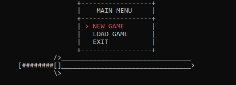
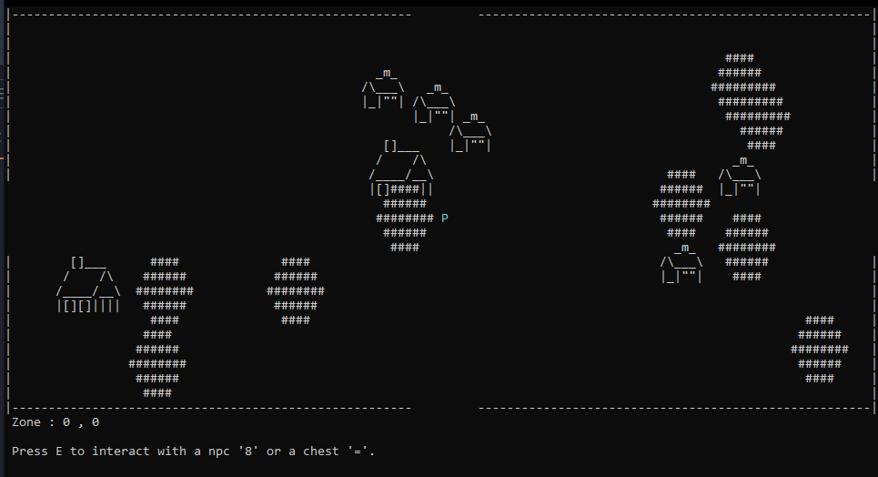
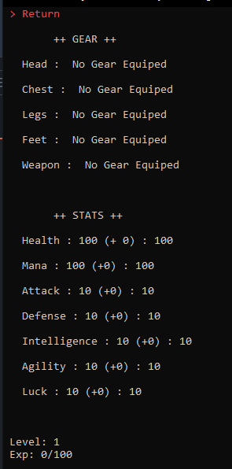
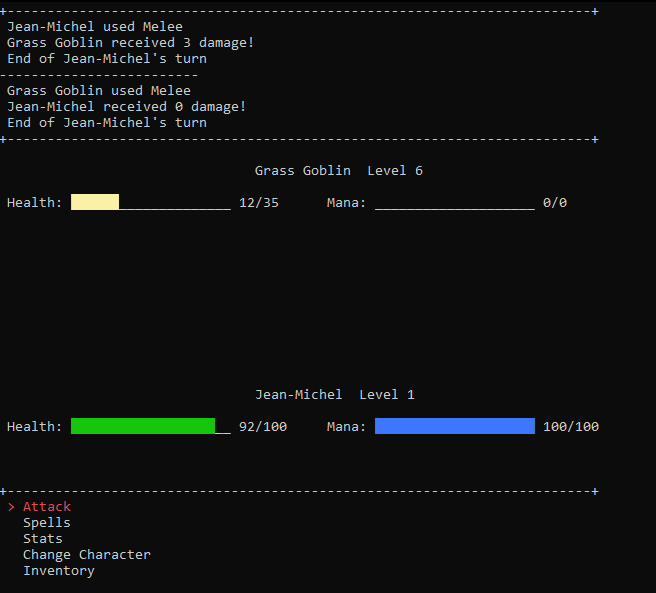
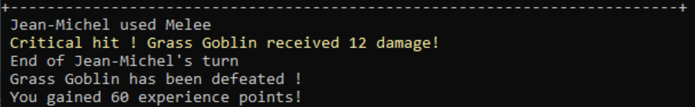
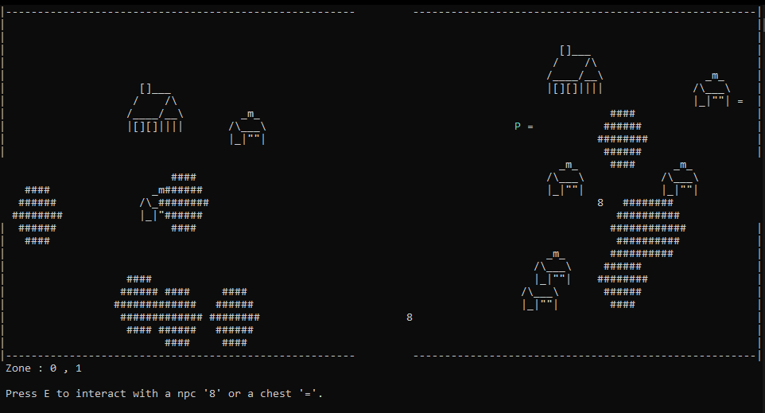

# ASCII-Fantasy
Jeu RPG sur terminal avec déplacement possible sur une carte générée aléatoirement.

# Images

# Auteurs
- Henri (46Yuu)
- Victor (Draknut)

# Setup
- Ouvrir la solution ASCII-Fantasy.sln sur visual studio 2022
- Compiler et lancer la solution
